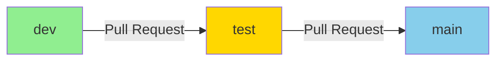

# Flujo de Trabajo Obligatorio: dev → test → main

Este documento describe el flujo de trabajo obligatorio para el proyecto con análisis automático de vulnerabilidades mediante Machine Learning.

## 📋 Estructura de Ramas Obligatoria

El proyecto **DEBE** mantener exactamente estas 3 ramas:

```
├── dev      (desarrollo)
├── test     (pruebas/staging)
└── main     (producción)
```

### ✅ Descripción de cada rama

| Rama | Propósito | Commits directos | Recibe desde |
|------|-----------|------------------|--------------|
| **dev** | Desarrollo diario | ✅ Permitido | N/A |
| **test** | Staging/Pruebas | ❌ Solo PR | dev |
| **main** | Producción | ❌ Solo PR | test |

---

## 🔄 Flujo de Trabajo Obligatorio



### Flujo paso a paso:

1. **Desarrollo en `dev`**
   - El desarrollador hace commits diarios en la rama `dev`
   - Todo código nuevo se integra primero aquí

2. **Pull Request: dev → test**
   - Cuando el código está listo para pruebas, crear PR desde `dev` hacia `test`
   - **🤖 Esto activa automáticamente el análisis ML de vulnerabilidades**
   - El sistema analizará todos los archivos TypeScript/JavaScript en `backend/**`

3. **Análisis automático**
   - GitHub Actions ejecuta el modelo ML
   - Detecta vulnerabilidades en el código
   - Genera comentario en el PR con resultados
   - Si es **VULNERABLE**: ❌ Bloquea el merge + Crea issue
   - Si es **SEGURO**: ✅ Permite el merge

4. **Merge a `test`**
   - Si el análisis aprueba, hacer merge a `test`
   - La rama `test` ahora contiene código validado por ML

5. **Pull Request: test → main**
   - Cuando se valida en test, crear PR desde `test` hacia `main`
   - Merge a `main` = versión estable en producción

---

## 🚫 Restricciones Obligatorias

### ❌ NO permitido:

- **Commits directos a `test`**
- **Commits directos a `main`**
- **PRs que omitan el flujo** (ej: dev → main directamente)
- **Merge de PRs con vulnerabilidades detectadas**

### ✅ Permitido:

- **Commits directos a `dev`**
- **PRs siguiendo el flujo: dev → test → main**
- **Hotfixes en `dev` que luego siguen el flujo**

---

## ⚙️ Configuración Inicial

### 1. Ejecutar script de configuración:

```powershell
.\setup-repository.ps1
```

Este script:
- ✅ Crea las 3 ramas (dev, test, main)
- ✅ Configura el remote de GitHub
- ✅ Sube todas las ramas al repositorio
- ✅ Te guía para configurar branch protection rules

### 2. Proteger ramas en GitHub

**Para la rama `test`:**

1. Ve a: `Settings > Branches > Add rule`
2. Branch name pattern: `test`
3. Configuración requerida:
   - ✅ Require pull request reviews before merging
   - ✅ Require status checks to pass before merging
     - Seleccionar: `Security ML Analysis`
   - ✅ Include administrators
   - ✅ Require linear history

**Para la rama `main`:**

1. Ve a: `Settings > Branches > Add rule`
2. Branch name pattern: `main`
3. Configuración requerida:
   - ✅ Require pull request reviews before merging
   - ✅ Require status checks to pass before merging
   - ✅ Include administrators
   - ✅ Require linear history

---

## 🧪 Probar el Flujo

### Opción 1: Scripts automatizados

```powershell
# 1. Configurar repositorio (una sola vez)
.\setup-repository.ps1

# 2. Probar con código SEGURO (debe pasar)
.\create-secure-pr.ps1

# 3. Probar con código VULNERABLE (debe ser bloqueado)
.\create-vulnerable-pr.ps1

# 4. Limpiar después de probar
.\cleanup-test-prs.ps1
```

### Opción 2: Manual

```bash
# 1. Desarrollar en dev
git checkout dev
# ... hacer cambios ...
git add .
git commit -m "feat: nueva funcionalidad"
git push origin dev

# 2. Crear PR dev → test
gh pr create --base test --head dev --title "Feature: ..." --body "..."

# 3. Esperar análisis ML (automático)

# 4. Si pasa, hacer merge

# 5. Crear PR test → main
gh pr create --base main --head test --title "Release: ..." --body "..."

# 6. Merge a main
```

---

## 🔍 Evento que Activa el Análisis ML

El workflow de GitHub Actions **SOLO** se activa cuando:

```yaml
on:
  pull_request:
    branches:
      - test  # Solo PRs hacia 'test'
    paths:
      - 'backend/**/*.ts'
      - 'backend/**/*.js'
```

**Esto significa:**
- ✅ PR desde `dev` → `test`: **SÍ** activa análisis
- ❌ PR desde `test` → `main`: **NO** activa análisis
- ❌ Commits directos a cualquier rama: **NO** activa análisis

---

## 📊 Ejemplo de Flujo Completo

```bash
# Día 1: Desarrollo
git checkout dev
# Desarrollar feature X
git commit -m "feat: implementar autenticación biométrica"
git push origin dev

# Día 2: Más desarrollo
git commit -m "feat: agregar validación de entrada"
git push origin dev

# Día 3: Listo para testing
gh pr create \
  --base test \
  --head dev \
  --title "Feature: Autenticación Biométrica" \
  --body "Implementa WebAuthn con validación"

# GitHub Actions ejecuta análisis ML automáticamente
# ⏳ Esperando resultado...

# ✅ Resultado: SEGURO - Sin vulnerabilidades
# Hacer merge del PR

# Día 4: Listo para producción
gh pr create \
  --base main \
  --head test \
  --title "Release v1.2.0" \
  --body "Nueva autenticación biométrica"

# Merge a main
# 🎉 Feature en producción
```

---

## ❗ Qué Hacer Si Falla el Análisis

Si el análisis ML detecta vulnerabilidades:

### 1. Revisar el comentario del bot
El bot creará un comentario en el PR con:
- 📋 Lista de vulnerabilidades detectadas
- 📁 Archivos afectados
- ⚠️ Tipo de vulnerabilidad
- 💡 Sugerencias de corrección

### 2. Se crea un issue automáticamente
- 🏷️ Etiquetado con `security-vulnerability`
- 📝 Contiene detalles del análisis
- 🔗 Vinculado al PR

### 3. El merge está bloqueado
- ❌ No puedes hacer merge hasta corregir
- 🔒 Protected branch rules lo previenen

### 4. Corregir en `dev`
```bash
git checkout dev
# Corregir vulnerabilidades
git commit -m "fix: corregir inyección SQL"
git push origin dev
# El PR se actualiza automáticamente y el análisis se vuelve a ejecutar
```

---

## 📈 Beneficios de Este Flujo

| Beneficio | Descripción |
|-----------|-------------|
| 🛡️ **Seguridad** | Todo código es analizado antes de llegar a producción |
| 🤖 **Automatización** | Análisis ML automático sin intervención manual |
| 📊 **Trazabilidad** | Historial completo de análisis en PRs |
| 🚫 **Prevención** | Bloquea código vulnerable antes del merge |
| 📚 **Documentación** | Issues automáticos documentan vulnerabilidades |
| ⚡ **Eficiencia** | Desarrolladores reciben feedback inmediato |

---

## 🔧 Configuración del Workflow

El workflow está en [.github/workflows/security-ml-analysis.yml](.github/workflows/security-ml-analysis.yml):

```yaml
name: Security ML Analysis

on:
  pull_request:
    branches:
      - test  # ← Solo activa en PRs a 'test'
    paths:
      - 'backend/**/*.ts'
      - 'backend/**/*.js'

jobs:
  security-analysis:
    runs-on: ubuntu-latest
    steps:
      - uses: actions/checkout@v4
      - name: Set up Python
        uses: actions/setup-python@v5
        with:
          python-version: '3.11'
      
      - name: Install dependencies
        run: |
          pip install -r security_ml/requirements.txt
      
      - name: Run ML Security Analysis
        env:
          GITHUB_TOKEN: ${{ secrets.GITHUB_TOKEN }}
          TELEGRAM_BOT_TOKEN: ${{ secrets.TELEGRAM_BOT_TOKEN }}
          TELEGRAM_CHAT_ID: ${{ secrets.TELEGRAM_CHAT_ID }}
        run: |
          python security_ml/analyze_pr.py
      
      - name: Fail if vulnerable
        if: failure()
        run: exit 1
```

---

## 📞 Soporte

Si tienes problemas con el flujo:

1. **Verificar configuración**: `.\setup-repository.ps1`
2. **Ver logs de GitHub Actions**: Tab "Actions" en GitHub
3. **Revisar documentación**: `security_ml/README.md`
4. **Probar localmente**: `python security_ml/test_analyzer.py`

---

## 📚 Documentación Relacionada

- [README.md](security_ml/README.md) - Documentación completa del sistema ML
- [QUICKSTART.md](security_ml/QUICKSTART.md) - Guía de inicio rápido
- [GITHUB_TESTING.md](security_ml/GITHUB_TESTING.md) - Guía de pruebas con GitHub
- [IMPLEMENTATION_SUMMARY.md](security_ml/IMPLEMENTATION_SUMMARY.md) - Resumen de implementación

---

**Última actualización:** 2 de febrero de 2026  
**Versión del flujo:** 1.0
