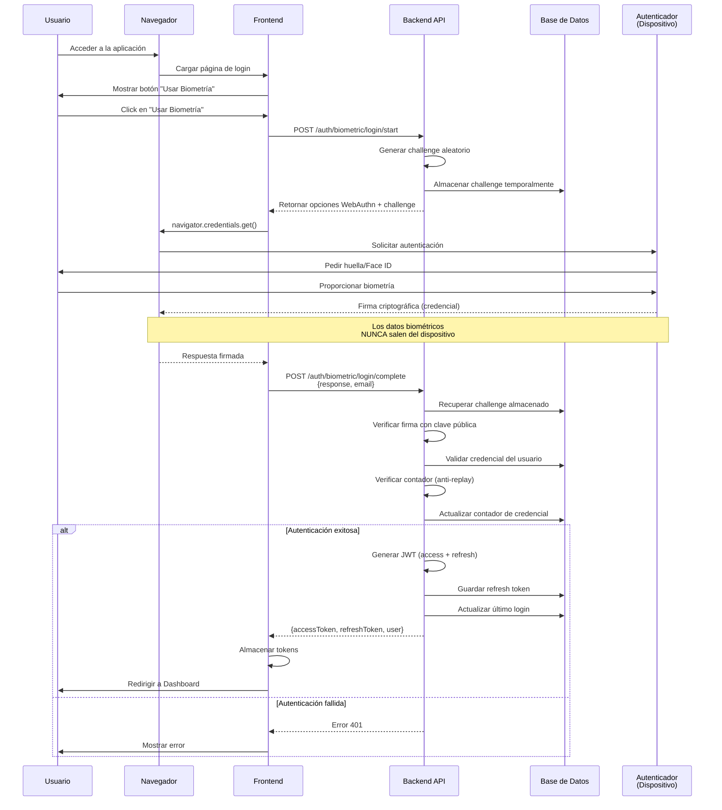
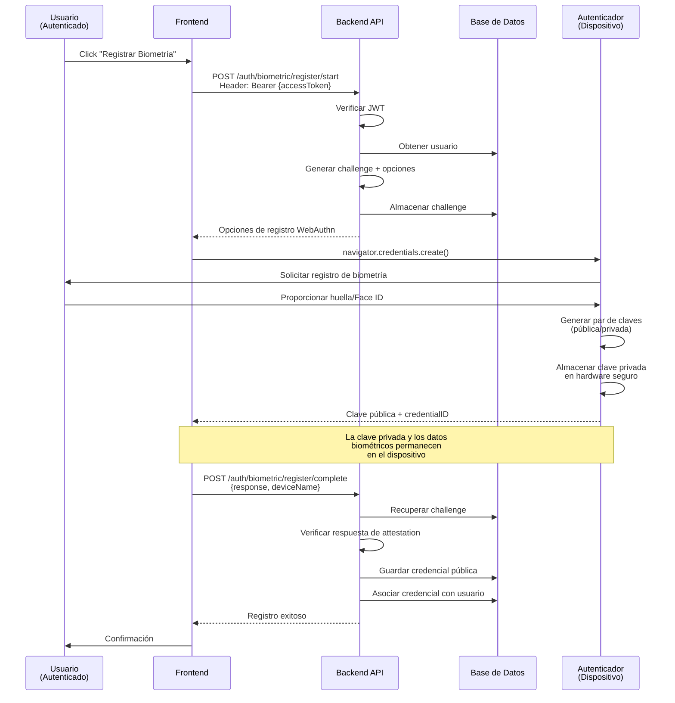
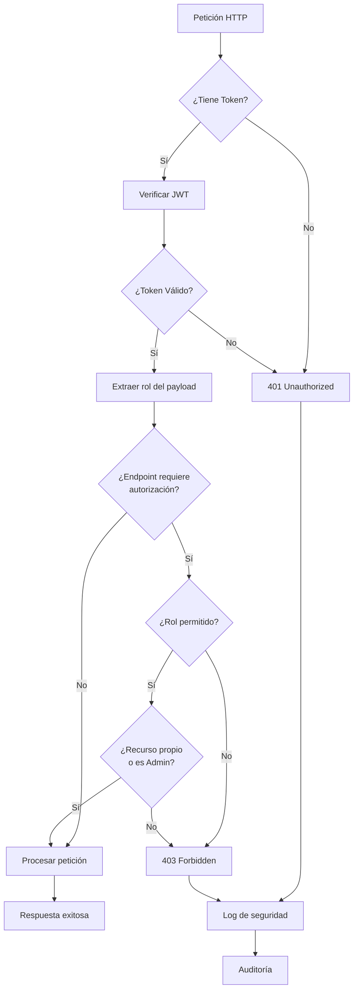
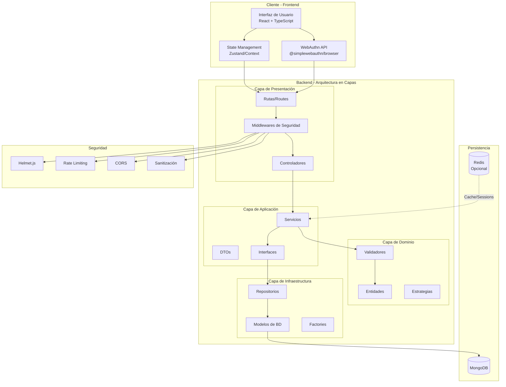
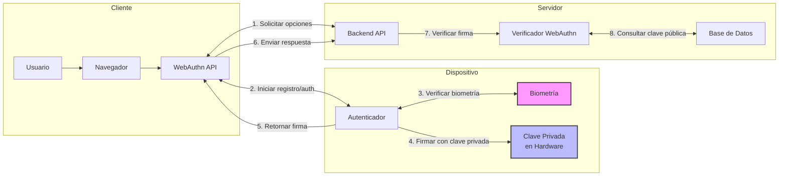
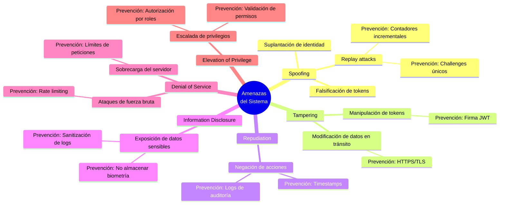
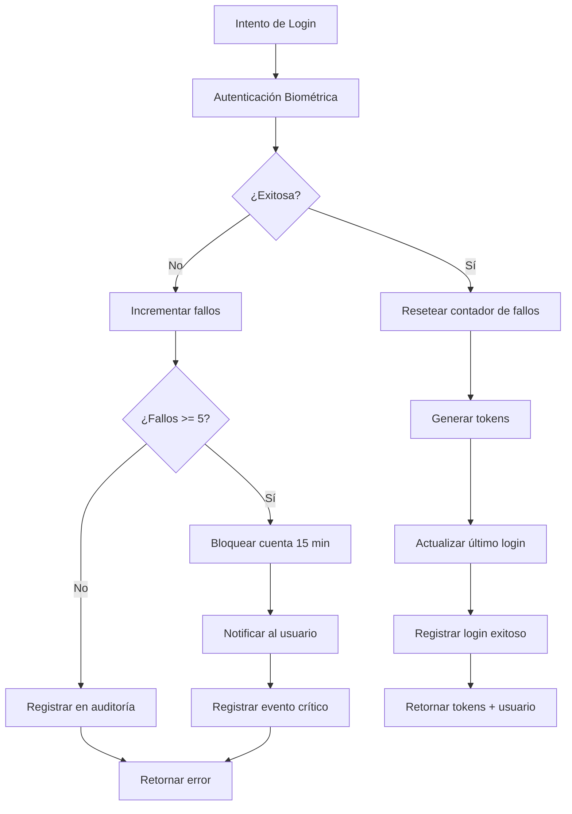
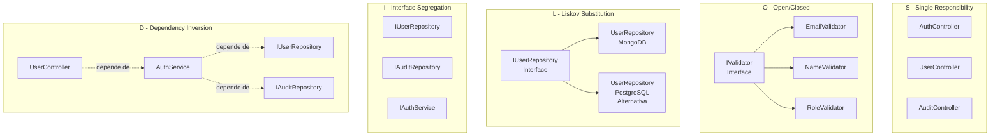

# Diagramas del Sistema - Autenticación Biométrica

## 1. Diagrama de Secuencia - Login Biométrico

## 2. Diagrama de Secuencia - Registro de Credencial Biométrica

## 3. Diagrama de Flujo - Autorización por Roles

## 4. Diagrama de Arquitectura del Sistema

## 5. Diagrama de Componentes - WebAuthn

## 6. Diagrama de Amenazas - STRIDE

## 7. Diagrama de Flujo - Manejo de Errores de Autenticación

## 8. Diagrama de Componentes - Principios SOLID

---

## Leyenda de Seguridad

- 🔐 **Cifrado**: Datos cifrados en tránsito y reposo
- 🛡️ **Validación**: Entrada validada y sanitizada
- 📝 **Auditoría**: Evento registrado en logs
- ⏱️ **Rate Limit**: Protección contra fuerza bruta
- 🔑 **Autenticación**: Requiere JWT válido
- 👮 **Autorización**: Requiere rol específico
